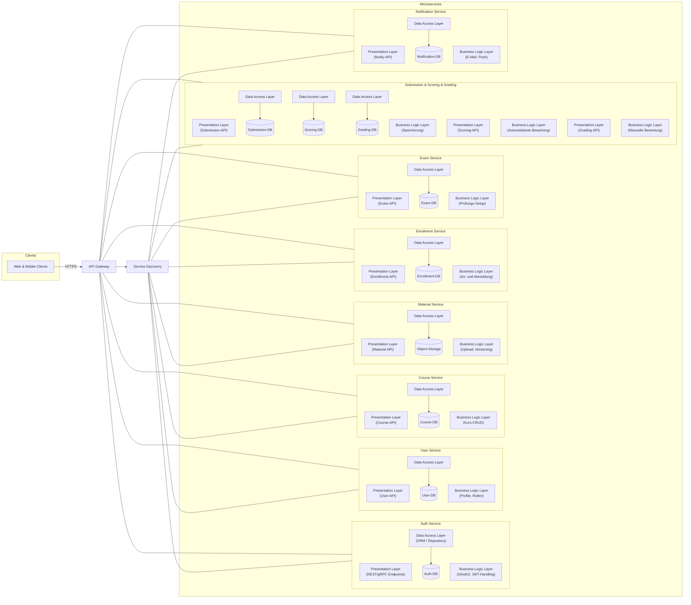

```mermaid
flowchart LR
  %% Clients
  subgraph Clients
    direction LR
    UI[Web & Mobile Clients]
  end

  %% API-Gateway und Service Discovery
  UI -->|HTTPS| APIGW[API Gateway]
  APIGW --> SD[Service Discovery]

  %% Microservices
  subgraph Microservices
    direction TB

    %% Auth-Service
    subgraph AuthSvc["Auth Service"]
      direction TB
      A1["Presentation Layer\n(REST/gRPC Endpoints)"]
      A2["Business Logic Layer\n(OAuth2, JWT-Handling)"]
      A3["Data Access Layer\n(ORM / Repository)"]
      A3 --> AuthDB[(Auth-DB)]
    end

    %% User-Service
    subgraph UserSvc["User Service"]
      direction TB
      U1["Presentation Layer\n(User-API)"]
      U2["Business Logic Layer\n(Profile, Rollen)"]
      U3["Data Access Layer"]
      U3 --> UserDB[(User-DB)]
    end

    %% Course-Service
    subgraph CourseSvc["Course Service"]
      direction TB
      C1["Presentation Layer\n(Course-API)"]
      C2["Business Logic Layer\n(Kurs-CRUD)"]
      C3["Data Access Layer"]
      C3 --> CourseDB[(Course-DB)]
    end

    %% Material-Service
    subgraph MaterialSvc["Material Service"]
      direction TB
      M1["Presentation Layer\n(Material-API)"]
      M2["Business Logic Layer\n(Upload, Versioning)"]
      M3["Data Access Layer"]
      M3 --> MaterialStore[(Object-Storage)]
    end

    %% Enrollment-Service
    subgraph EnrollmentSvc["Enrollment Service"]
      direction TB
      E1["Presentation Layer\n(Enrollment-API)"]
      E2["Business Logic Layer\n(An- und Abmeldung)"]
      E3["Data Access Layer"]
      E3 --> EnrollDB[(Enrollment-DB)]
    end

    %% Exam-Service
    subgraph ExamSvc["Exam Service"]
      direction TB
      X1["Presentation Layer\n(Exam-API)"]
      X2["Business Logic Layer\n(Prüfungs-Setup)"]
      X3["Data Access Layer"]
      X3 --> ExamDB[(Exam-DB)]
    end

    %% Submission-, Scoring- & Grading-Services
    subgraph Submits["Submission & Scoring & Grading"]
      direction TB
      S1["Presentation Layer\n(Submission-API)"]
      S2["Business Logic Layer\n(Speicherung)"]
      S3["Data Access Layer"]
      S3 --> SubmDB[(Submission-DB)]

      SC1["Presentation Layer\n(Scoring-API)"]
      SC2["Business Logic Layer\n(Automatisierte Bewertung)"]
      SC3["Data Access Layer"]
      SC3 --> ScoreDB[(Scoring-DB)]

      G1["Presentation Layer\n(Grading-API)"]
      G2["Business Logic Layer\n(Manuelle Bewertung)"]
      G3["Data Access Layer"]
      G3 --> GradeDB[(Grading-DB)]
    end

    %% Notification-Service
    subgraph NotifSvc["Notification Service"]
      direction TB
      N1["Presentation Layer\n(Notify-API)"]
      N2["Business Logic Layer\n(E-Mail, Push)"]
      N3["Data Access Layer"]
      N3 --> NotifyDB[(Notification-DB)]
    end
  end

  %% Gateway verbindet sich mit allen Services
  APIGW --- AuthSvc
  APIGW --- UserSvc
  APIGW --- CourseSvc
  APIGW --- MaterialSvc
  APIGW --- EnrollmentSvc
  APIGW --- ExamSvc
  APIGW --- Submits
  APIGW --- NotifSvc

  %% Service Discovery registriert alle Services
  SD --- AuthSvc
  SD --- UserSvc
  SD --- CourseSvc
  SD --- MaterialSvc
  SD --- EnrollmentSvc
  SD --- ExamSvc
  SD --- Submits
  SD --- NotifSvc
```
